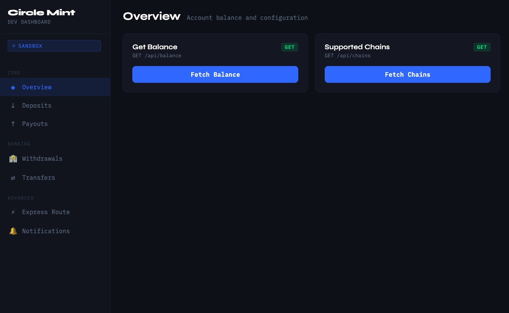

# Circle Mint Testing App



A testing application for Circle Mint APIs. Interact with the full Circle Mint surface through a **web dashboard UI** or the **CLI**.

**Learn more:**
- [Circle Mint Documentation](https://developers.circle.com/circle-mint/introducing-circle-mint)
- [Circle Mint API Reference](https://developers.circle.com/api-reference/circle-mint)

---

## Quick Start

```bash
npm install
cp .env.example .env   # add your CIRCLE_API_KEY
npm run server         # → http://localhost:3000
```

---

## Web Dashboard

The primary interface. Start the server and open your browser:

```bash
npm run server
# Open http://localhost:3000
```

### Sections

| Section | What you can do |
|---|---|
| **Overview** | Check account balance, list supported chains |
| **Deposits** | List deposit addresses, create deposit addresses, list deposits |
| **Payouts** | Manage address book recipients, send crypto payouts (USDC/EURC) |
| **Withdrawals** | Create/list wire accounts, get wire instructions, mock wire deposits, withdraw to bank |
| **Transfers** | Create/list recipient addresses, send business transfers |
| **Express Route** | Full 7-step flow for auto-redeeming on-chain USDC to local fiat |
| **Notifications** | Subscribe to webhooks, delete subscriptions, live event stream |

### Live Notifications

The dashboard connects to `/api/events` (SSE) and displays incoming Circle webhooks in real time.

For local development, expose the server with a tunnel and register your webhook endpoint:

```bash
ngrok http 3000
# Use the HTTPS URL as your subscription endpoint in the Notifications tab
# Webhooks arrive at: https://<your-ngrok-id>.ngrok.io/webhooks
```

### Express Route flow

The **Express Route** section walks through all 7 steps for auto-redeeming on-chain USDC to local fiat currency. Run steps individually or click **⚡ Run All Steps** to execute the full flow end-to-end.

| Step | Action |
|---|---|
| 1 | Link wire bank account |
| 2 | Create on-chain receipt address |
| 3 | Simulate wire deposit (sandbox) |
| 4 | Simulate on-chain deposit (sandbox) |
| 5 | Send on-chain transfer to verified recipient |
| 6 | Withdraw (fiat offramp) to bank |
| 7 | Create express route binding receipt address → bank |

---

## CLI

All commands are also available from the terminal.

### Setup

```bash
npm install
```

Create a `.env` file:

```env
CIRCLE_API_KEY=your_api_key_here
CIRCLE_ENV=sandbox
```

Get your API key from the [Circle Developer Console](https://console.circle.com).

### npm scripts

| Script | Description |
|---|---|
| `npm run server` | Start the web dashboard at http://localhost:3000 |
| `npm run dev <cmd>` | Run any CLI command (see below) |
| `npm run account <cmd>` | Account & transfer sub-commands |
| `npm run express-route <cmd>` | Express route sub-commands |
| `npm run build` | Compile TypeScript |

### Core commands (`npm run dev`)

```bash
npm run dev balance                          # Account balance
npm run dev chains                           # Supported chains
npm run dev deposits                         # List deposit addresses
npm run dev deposits create ETH              # Create deposit address
npm run dev deposits list                    # List deposits
npm run dev payouts                          # List payouts
npm run dev withdraw list-banks              # List wire bank accounts
npm run dev withdraw setup                   # Create wire bank account (sandbox data)
npm run dev withdraw instructions <bank-id>  # Get wire instructions
npm run dev withdraw mock <ref> <amt> <acct> # Simulate wire deposit (sandbox)
npm run dev withdraw <bank-id> <amt> [curr]  # Withdraw to bank
```

### Account & transfer commands (`npm run account`)

```bash
npm run account balance
npm run account create-wire-account
npm run account list-wire-accounts
npm run account get-wire-instructions <id>
npm run account mock-wire <trackingRef> <amount> <accountNumber>
npm run account create-recipient <chain> <address> <description> [tag]
npm run account list-recipients
npm run account get-recipient <id>
npm run account business-transfer <recipient-id> <amount> [currency]
npm run account business-payout wire <bank-id> <amount> [currency]
npm run account business-payouts [status]
npm run account business-status <payout-id>
npm run account create-deposit-address <chain> [currency]
```

### Express route commands (`npm run express-route`)

```bash
npm run express-route link-bank                              # Step 1
npm run express-route link-receipt ETH USD                   # Step 2
npm run express-route mock-deposit <trackRef> <amt> <acct>   # Step 3
npm run express-route onchain-deposit <address> ETH 10.00    # Step 4
npm run express-route transfer <recipient-id> 1.00 USD       # Step 5
npm run express-route withdraw <bank-id> 10.00 USD           # Step 6
npm run express-route create <receipt-addr-id> <bank-id>     # Step 7
npm run express-route run                                    # All steps
```

---

## Crypto Payouts — two-step flow

The Crypto Payouts API requires addresses to be pre-registered in an address book before a payout can be sent. This applies both to the UI and CLI.

1. **Add to address book** → receive a recipient UUID
2. **Send payout** using that UUID

```bash
# Via dashboard: Payouts → Step 1 (Add to Address Book) → Step 2 (Create Payout)
```

Currency is always `USD` (USDC) or `EUR` (EURC) — not the chain's native token. Amounts are automatically formatted to 2 decimal places.

---

## Environment Variables

| Variable | Description | Required | Default |
|---|---|---|---|
| `CIRCLE_API_KEY` | Your Circle API key | Yes | — |
| `CIRCLE_ENV` | `sandbox` or `production` | No | `sandbox` |
| `CIRCLE_BASE_URL` | Custom API base URL | No | Auto-detected |
| `PORT` | Web server port | No | `3000` |

---

## Getting Test Funds

1. **Circle Faucet:** [https://faucet.circle.com](https://faucet.circle.com) — testnet USDC (once per hour)
2. **Mock wire deposit:** Use `withdraw mock` or the dashboard Withdrawals → Mock Wire Deposit

See [TEST_FUNDS_GUIDE.md](./TEST_FUNDS_GUIDE.md) for details.

---

## Resources

- [Circle Mint Documentation](https://developers.circle.com/circle-mint/introducing-circle-mint)
- [Circle Mint API Reference](https://developers.circle.com/api-reference/circle-mint)
- [Circle Developer Console](https://console.circle.com)
- [Circle Sandbox Signup](https://app-sandbox.circle.com/signup)
- [Circle Notifications](https://developers.circle.com/circle-mint/circle-apis-notifications-quickstart)
- [Circle MCP Server](https://developers.circle.com/ai/mcp)

## License

MIT
